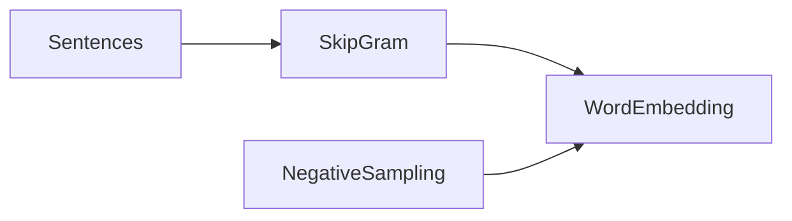
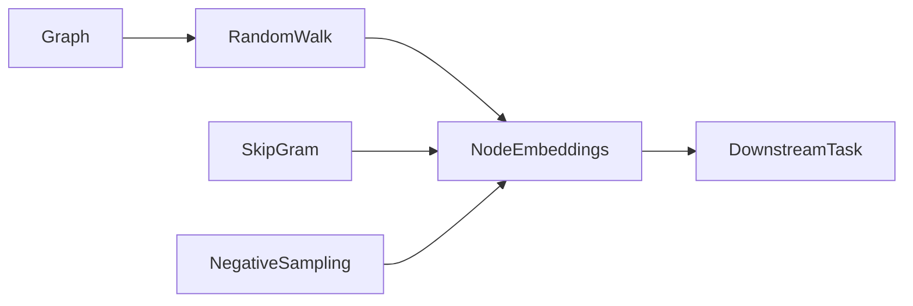
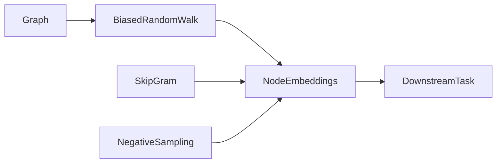
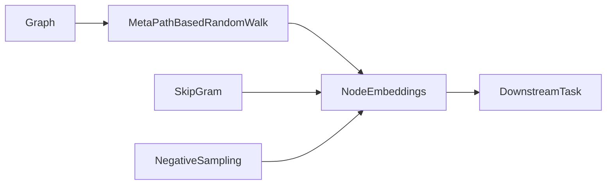

本文基于百度飞桨图神经网络七日打卡营，并参考[PGL代码库](https://github.com/PaddlePaddle/PGL)。

图神经网络学习路线

1. 基础入门：基础概念、基本原理

2. 经典算法：DeepWalk、GCN、GAT、GraphSage

3. 前沿论文：顶会论文

### 基础入门

### 图的基础概念

图起源于著名的七桥问题，是一种统一描述复杂事物的语言，在社交网络、互联网、推荐系统、化学分子等领域应用广泛。图(**G**raph)就是节点(**V**ertices/Nodes)以及边(**E**dge)：

$$
G = (V, E)
$$

图的分类：
1. 无向图 vs 有向图
2. 无权图 vs 有权图
3. 同构图 vs 异构图

图的度和邻居

图的表示：邻接矩阵、邻接表、边集
1. 无向图的邻接矩阵是对称矩阵。
2. 邻接表对于稀疏(sparse)大(large)图而言非常友好，允许我们快速获得给定节点的所有邻居。

结构特征、节点特征$$e$$、边特征$$v$$。

$$
G = (V, E, e, v)
$$

语音、图像、文本具有整齐**规则**的数据结构，然而现实中的图是**不规则**的，难以对其进行直接数学建模。对于一般深度学习模型，难以处理不规则数据。**图学习**的优势在于可以方便地处理不规则数据(图)，充分利用图结构信息。
<!-- more -->

### 图学习的基本原理

图学习主要应用于节点、边以及图三个级别的任务上，在金融、物理、生物、化学，用户交互、交通、计算机视觉、自然语言处理等领域应用前景广泛。

1. 节点级别任务：金融诈骗检测、目标检测

2. 边级别任务：推荐系统
3. 图级别任务：气味识别

### 图学习算法分类

1. 图游走类算法
   - DeepWalk
   - Node2Vec
   - Struct2Vec
   - LINE
   - ...
2. 图神经网络算法
   - 卷积网络
     - 谱卷积
       - GCN
       - ChebGCN
       - AGCN
     - 空间卷积
       - GCN
       - GAT
       - GaaN
       - ...
   - 递归网络
     - Tree LSTM
     - Graph LSTM
3. 知识图谱嵌入算法
   - TransE
   - TransR
   - ...

### 图学习框架
1. [Paddle Graph Learning (PGL)](https://github.com/PaddlePaddle/PGL)

2. [Deep Graph Library (DGL)](https://github.com/dmlc/dgl)

3. [PyTorch Geometric (PyG)](https://github.com/rusty1s/pytorch_geometric)

4. [Ant Graph machine Learning system (AGL)](https://dl.acm.org/doi/pdf/10.14778/3415478.3415539)

5. [tf_geometric](https://github.com/CrawlScript/tf_geometric)

### 经典算法

### 图游走类算法
目标：Node embeddings, 即学习到节点与邻居的关系，用于下游任务。

### 1. Word2vec
图游走类模型最开始参考的就是 NLP 领域中的 Word2vec 模型。
Word2vec 整体架构：

Skip Gram： 根据中心词预测上下文

Negative Sampling：负采样，只对正样本和选取的负样本进行分类，从而减少计算量

### 2. DeepWalk
将 NLP 领域的思想运用到图(网络)嵌入领域：
- 节点 -> 单词
- 节点序列 -> 句子

DeepWalk 整体架构：

游走方式：Random Walk

### 3. node2vec
node2vec 整体架构：

游走方式：bias random walk

### 4. metapath2vec
metapath2vec 整体架构：

游走方式：基于meta path

### 5. metapath2vec++

内容持续更新中...

### 心得体会

飞桨图神经网络学习课程每日作业都十分简单，但是我都有认真的完成，收获颇丰，非常感谢PGL团队的各位老师和大佬。

注：内容大部份来自百度飞桨图神经网络7日打卡营，欢迎转载。